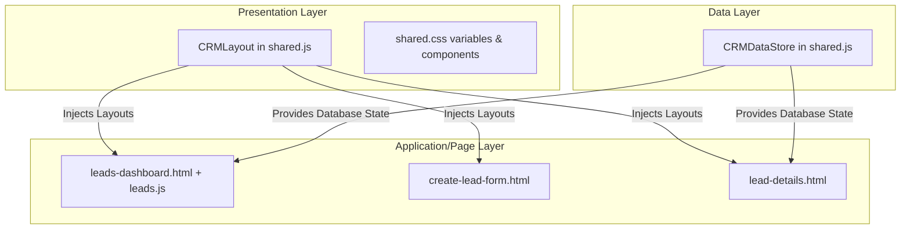

# Refactoring Design Decisions & Thought Process

This document logs the design and architectural choices made when transforming the SalesNest CRM leads frontend into an enterprise-grade B2B SaaS architecture.

---

## 1. 3-Layer Inspired Frontend Structure

To make the code scalable and clean, we split the application into three decoupled layers:

1. **Presentation & Styling Layer (`shared.css`)**: Holds HSL color variables, page grid configurations, responsive breakpoints, sticky headers, table spacing, and card layouts.
2. **Global Components & Layout Layer (`shared.js` -> `CRMLayout`)**: Renders layout elements dynamically into simple HTML placeholders (`

`), building collapsible sidebars and responsive navbar breadcrumbs without duplicate template code.
3. **Module Controllers Layer (`leads.js`)**: Focuses on page-specific render routines, query searches, and event listeners.

---

## 2. Dynamic Collapsible Navigation

The navigation sidebar is a key component of modern SaaS software (Linear/HubSpot):
* **Desktop Collapsible State**: A toggle button collapses the panel from `240px` to `72px`, hiding textual labels and showing only icons with smooth transitions.
* **Persistent Preference**: Preference is stored in `localStorage` (`crm_sidebar_collapsed` = `true`/`false`) so it remains collapsed/expanded when clicking between pages.
* **Active State Highlight**: Sidebar loops through the current URL path to identify which module is active, highlighting the correct item.
* **Mobile Drawer**: Toggling the sidebar on tablet/mobile screens draws the menu in from off-screen (`left: -240px` to `left: 0`) as a drawer menu overlay.

---

## 3. High-Fidelity UI/UX Components

### Loading Skeletons
To mimic modern SPA data fetching, we added CSS-animated loading placeholders:
* Skeletons (`.skeleton-pulse`) appear in the table rows initially.
* `leads.js` runs a `setTimeout` of `500ms` before populating the table rows and metrics cards, showing a smooth transition from loading placeholder to active records.

### Dashboard KPI Metrics & Activity Feeds
* **Conversion Progress Card**: Calculates the percentage of converted leads and animates a progress bar based on status statistics.
* **Recent Activities Log**: Modifying leads logs audits inside `CRMDataStore.activities` (e.g. creating, deleting, note logging, and status conversion). The dashboard displays these as a chronological timeline feed with descriptive icons.
